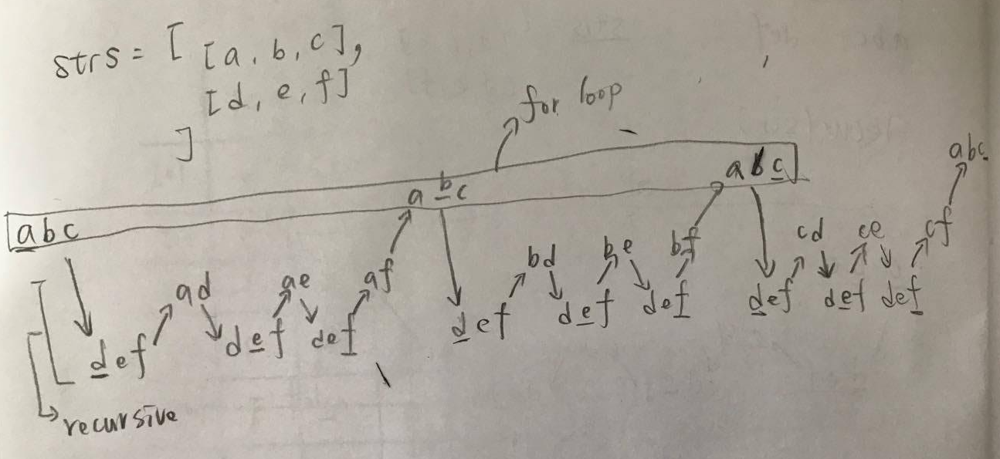

# Top Interview Questions 

# 1. Two Sum
## Description
Given an array of integers, return indices of the two numbers such that they add up to a specific target.

You may assume that each input would have exactly one solution, and you may not use the same element twice.

## **Example:**

```py
Given nums = [2, 7, 11, 15], target = 9,

Because nums[0] + nums[1] = 2 + 7 = 9,
return [0, 1].
```

## **Solution:**

```py
class Solution:
    def twoSum(self, nums, target):
        """
        :type nums: List[int]
        :type target: int
        :rtype: List[int]
        """
        if len(nums) <= 1:
            return False
        buffer_dict = {}

        for i in range(0, len(nums)):
            if nums[i] in buffer_dict:
                return [buffer_dict[nums[i]], i]
            else:
                buffer_dict[target - nums[i]] = i


if __name__ == '__main__':
    obj1 = Solution()

    print(obj1.twoSum(nums=[2, 7, 11, 15],target=9))

```

# 2. Add Two Numbers
## **Description**
You are given two **non-empty** linked lists representing two non-negative integers. The digits are stored in reverse order and each of their nodes contain a single digit. Add the two numbers and return it as a linked list.

You may assume the two numbers do not contain any leading zero, except the number 0 itself.

**Input:** (0 -> 1) + (0 -> 1 -> 2)  
**Output:** 0 -> 1 -> 2

**Input:** (0 -> 1) + ()  
**Output:** 0 -> 1

**Input:** (9 -> 9) + (1)  
**Output:** 0 -> 0 -> 1

## **Solution:**
```py
class ListNode(object):
    def __init__(self, x):
        self.val = x
        self.next = None

class Solution(object):
    def addTwoNumbers(self, l1, l2):
        """
        :type l1: ListNode
        :type l2: ListNode
        :rtype: ListNode
        """
        ptr1 = l1
        ptr2 = l2
        carry = 0
        head=ListNode(0)
        ptr = head

        while ptr1!=None or ptr2!=None :

            x = ptr1.val if (ptr1!=None) else 0
            y = ptr2.val if (ptr2!=None) else 0
            sum = (x+y+carry)
            carry = sum // 10
            ptr.next = ListNode( sum % 10)
            ptr = ptr.next
            if ptr1 != None: ptr1 = ptr1.next
            if ptr2 != None: ptr2 = ptr2.next


        if carry>0:
            ptr.next = ListNode(carry)

        return head.next
```

## Follow up

What if the the digits in the linked list are stored in non-reversed order? For example:

(3→4→2)+(4→6→5)=8→0→7

# 3. Longest Substring Without Repeating Characters
Given a string, find the length of the longest substring without repeating characters.

## **Examples:**

Given `"abcabcbb"`, the answer is `"abc"`, which the length is `3`.

Given `"bbbbb"`, the answer is `"b"`, with the length of `1`.

Given `"pwwkew"`, the answer is `"wke"`, with the length of `3`. Note that the answer must be a substring, `"pwke"` is a subsequence and not a substring.

## **Solution:**
### My solution: Time limit exceeded
```py
class Solution(object):
    def lengthOfLongestSubstring(self, s):
        """
        :type s: str
        :rtype: int
        """

        buffer_list  = []
        longest_list = []

        for i in range(0,len(s)):
            for j in range(i, len(s)):
                if s[j] not in buffer_list:
                    buffer_list.append(s[j])
                else:
                    if len(buffer_list) > len(longest_list):
                        longest_list = buffer_list
                    buffer_list = []
                    break

        if len(buffer_list) > len(longest_list):
            longest_list = buffer_list

        longest_num= len(longest_list)
        return longest_num
```
Time complexity: O(n^3)

### Optimizied Solution

Define a mapping of the characters to its index. Then we can skip the characters immediately when we found a repeated character.

The reason is that if `s[j]` have a duplicate in the range `[i, j)` with index `j'`, we don't need to increase i little by little. We can skip all the elements in the range `[i, j']` and let `i` to be `j' + 1` directly.

```py
# Optimized solution
class Solution(object):
    def lengthOfLongestSubstring(self, s):
        """
        :type s: str
        :rtype: int
        """

        start = 0
        maxlength = 0

        buffer_dict={}

        for i in range(0,len(s)):
            if s[i] in buffer_dict and start <= buffer_dict[s[i]]:
                start=buffer_dict[s[i]]+1
            else:
                maxlength = max(maxlength, i-start+1)
            buffer_dict[s[i]] = i


        return maxlength
```

# 5. Longest Palindromic Substring  

Given a string `s`, find the longest palindromic substring in `s`. You may assume that the maximum length of s is `1000`.

## **Examples:**

> Input: "babad"  
Output: "bab"  
Note: "aba" is also a valid answer.

> Input: "cbbd"  
Output: "bb"

## **Solution:**

### My solution: Time limit exceeded
```py
def isPalindrom(s):
    for i in range(0,len(s)//2):
        if s[i] != s[len(s)-i-1]:
            return False
    return True


class Solution(object):
    def longestPalindrome(self, s):
        """
        :type s: str
        :rtype: str
        """
        longest = ""

        for i in range(0,len(s)):
            for j in range(i, len(s)):
                if isPalindrom(s[i:(j+1)]) and len(s[i:(j+1)])> len(longest):
                    longest = s[i:(j+1)]
        return longest
```
Time complexity: $O(n^3)$

### Solution: Dynamic Programming:

Consider the case `ababa`. If we already knew that `bab` is a palindrome, it is obvious that `ababa` must be a palindrome since the two left and right end letters are the same.

We define $P(i,j)$ as following:  

> $$
P(i,j)=\left\{ \begin{array}{rl} 
True  & \text{if the substring } S_{i},...,S_{j} \text{ is a palindrome}  \\
False & \text{Otherwise.}
\end{array} \right.
$$
  
Therefore,  
> $$
P(i,j) = ( P(i+1,j-1) \text{ and } S_{i}==S_{j} )
$$

The base cases are:
> $$
P(i,i) = true
$$  

> $$
P(i,i+1) = (S_{i}==S_{i+1})
$$

```py
import numpy as np

class Solution(object):
    def longestPalindrome(self, s):
        """
        :type s: str
        :rtype: str
        """
        dp = np.full((len(s),len(s)), False, dtype=bool)
        longeset = ""

        for i in range(len(s),-1,-1):
            for j in range(i,len(s)):
                if s[i]==s[j] and (j-i<2 or dp[i+1,j-1]):
                    dp[i,j]=True
                    if len(s[i:(j+1)])> len(longeset):
                        longeset = s[i:(j+1)]

        return longeset
```

####  Illustration


以 `str="abaabc"` 為例子, 先準備 2-dimensional table, table 的大小為 `(len(str),len(str))` , table 的值為 boolean, 全部初始化為 False

表的每一個 cell 的意思,代表連續字串是否為 palindrome, 例如 `i=0` and `j=5`, 代表的意思就是 字串`str[0:6]` ($P(i=0,j=5)$) 是否為 palindrome, 如果是,那 $P(i=0,j=5)=\text{True}$, 反之亦然


首先, 要處理 base case, base case 有兩種:

1. 先處理對角線, $P(i,i) = true, i = 0,...,5$, $P(i,i)$ 代表 $S_{i}==S_{i}$, 自己字元跟自己字元比當然一樣, 所以是 true, 

2. 再來一次處理兩個字元 $P(i,i+1) = (S_{i}==S_{i+1}), i = 0,...,5$, 所以會有以下組合 $P(0,1),P(1,2),P(2,3),P(3,4),P(4,5)$

Base cases 處理完了接下來就是動態規劃的部分, 
> $P(i,j) = ( P(i+1,j-1) \text{ and } S_{i}==S_{j} )$ 代表的意思是判斷 $P(i+1,j-1)$ 為真或假, 再來判斷 $S_{i}==S_{j}$ 是不是一樣, 如果兩個都是 True, 那代表 $P(i,j)$ 為 True, 

來舉個例子吧, 下表已經處理完 Base bases, 這時候要處理 $P(0,2)$, 因為我們知道不含頭尾中間的字串為真 (之前已經比過的 $P(1,1)$) , 所以如果頭尾字元都一樣 ($S_{0}==S_{2}$), 那代表 $P(0,2)$ 就一定是 palindrome, 
整個寫出來就是 
> $P(0,2) = ( P(1,1) \text{ and } S_{0}==S_{2} )$  
$P(1,3) = ( P(2,2) \text{ and } S_{1}==S_{3} )$  
$P(2,4) = ( P(3,3) \text{ and } S_{2}==S_{4} )$  
$P(3,5) = ( P(4,4) \text{ and } S_{3}==S_{5} )$

|   |   |       |       |  j    |       |     |     |
|:--|:--|:--    |:--    | :--   | :--   | :-- | :-- |
|   |   |[0]    |[1]    | [2]   | [3]   | [4] | [5] |
|   |[0]| True  | False |       |       |     |     |
|   |[1]| False | True  | False |       |     |     |
| i |[2]| False | False | True  | True  |       |     |
|   |[3]| False | False | False | True  | False |     |
|   |[4]| False | False | False | False | True  | False    |
|   |[5]| False | False | False | False | False |  True   |

要注意處理的順序, 一定要先將目前處理字串 ($P(i,j)$) 的左下 cell 先求出 ($P(i+1,j-1)$), 所以可以將base cases 處理完, 再依序處理連續3個字元, 4個字元,...,etc

4個字元:
> $P(0,3) = ( P(1,2) \text{ and } S_{0}==S_{3} )$  
$P(1,4) = ( P(2,3) \text{ and } S_{1}==S_{4} )$  
$P(2,5) = ( P(3,4) \text{ and } S_{2}==S_{5} )$  

5個字元:
> $P(0,4) = ( P(1,3) \text{ and } S_{0}==S_{4} )$  
$P(1,5) = ( P(2,4) \text{ and } S_{1}==S_{5} )$  

# 7. Reverse Integer
Reverse digits of an integer.

Example1: x = 123, return 321  
Example2: x = -123, return -321

```py
class Solution(object):
    def reverse(self, x):
        rev = 0

        negative = False
        if x < 0 :
            negative = True
            x = 0-x

        while x!=0:
            rev = rev*10+ x%10
            x = x//10

            if rev > (2**31)-1:
                return 0

        if negative:
            rev = 0-rev

        return rev
```

# 11. Container With Most Water
Given $n$ non-negative integers $a_{1}, a_{2}, ..., a_{n}$, where each represents a point at coordinate $(i, a_{i})$. $n$ vertical lines are drawn such that the two endpoints of line $i$ is at $(i, a_{i})$ and $(i, 0)$. Find two lines, which together with x-axis forms a container, such that the container contains the most water.

Note: You may not slant the container and n is at least 2.

## **Example:**
```py
height = [1, 8, 6, 2, 5, 4, 8, 3, 7]
```


## **Solutions:**
### My Solution: Brute Force

```py
class Solution(object):
    def maxArea(self, height):
        """
        :type height: List[int]
        :rtype: int
        """
        max_area = 0

        for i in range(0,len(height)):
            for j in range(i+1,len(height)):
                max_area = max(max_area,min(height[i],height[j])*(j-i))

        return max_area
```
* Complexity Analysis: $O(n^2)$, Calculating area for all $\frac{n(n-1)}{2}$ height pairs.
* Space complexity : $O(1)$

### Solution: Two pointer method
```py
import numpy as np

class Solution(object):
    def maxArea(self, height):
        """
        :type height: List[int]
        :rtype: int
        """
        max_area = 0
        i = 0
        j = len(height)-1

        while(i!=j):
            max_area = max(max_area, min(height[i], height[j]) * (j - i))
            if np.argmin([height[i], height[j]])==0:
                i+=1
            else :
                j-=1
        return max_area
```

* Complexity Analysis: $O(n)$
* Space complexity : $O(1)$


# 14. Longest Common Prefix
Write a function to find the longest common prefix string amongst an array of strings.

Input: `['abcd','abccc','abdec']`  
Output: `'ab'`

## My solution: Brute Force
```py
class Solution(object):
    def longestCommonPrefix(self, strs):
        """
        :type strs: List[str]
        :rtype: str
        """
        common_prefix = ""

        min = 100000
        cnt = 0
        for item in strs:
            if len(item)<=min:
                min = len(item)

        for j in range(0,min):
            for i in range(1, len(strs)):
                if strs[0][j]!=strs[i][j]:
                    return common_prefix

                cnt+=1

                if cnt==(len(strs)-1):
                    common_prefix += strs[0][j]
                    cnt=0
        if len(strs)==1:
            return strs[0]

        return common_prefix
```

## Solution: Using Zip
```py
class Solution:
    # @return a string
    def longestCommonPrefix(self, strs):
        if not strs:
            return ""

        for i, letter_group in enumerate(zip(*strs)):
            if len(set(letter_group)) > 1:
                return strs[0][:i]
        else:
            return min(strs)
```

# 15. 3Sum
Given an array S of `n` integers, are there elements `a, b, c` in `S` such that `a + b + c = 0`? Find all unique triplets in the array which gives the sum of zero.

> For example, given array S = [-1, 0, 1, 2, -1, -4],  
A solution set is:  
[  
  [-1, 0, 1],  
  [-1, -1, 2]  
]

## Solution:
Three pointer: 
```py
class Solution(object):
    def threeSum(self, nums):
        res = []
        nums.sort()

        for i in range(0,len(nums)-2):
            l = i+1
            r = len(nums)-1
            if i > 0 and nums[i] == nums[i - 1]:
                continue

            while l<r:
                s = nums[i] + nums[l] + nums[r]
                if s<0:
                    l+=1
                elif s>0:
                    r-=1
                else:
                    res.append([nums[i],nums[l],nums[r]])

                    while l<r and nums[l]==nums[l+1]: 
                        l+=1
                    while l<r and nums[r]==nums[r-1]:
                        r-=1

                    l+=1
                    r-=1
        return res
```

# 17. Letter Combinations of a Phone Number
Given a digit string, return all possible letter combinations that the number could represent.

A mapping of digit to letters (just like on the telephone buttons) is given below.

**Input:** Digit string `"23"`  
**Output:** `["ad", "ae", "af", "bd", "be", "bf", "cd", "ce", "cf"]`

## My solution: Recursive

```py
def perm(strs,buffer_str,empty_list):
    for i in strs[0]:
        if len(strs)>1:
            perm(strs[1:],buffer_str+i,empty_list)
        else:
            empty_list.append(buffer_str+i)
    return empty_list

class Solution(object):
    def letterCombinations(self, digits):
        """
        :type digits: str
        :rtype: List[str]
        """

        empty_list = []
        strs = []

        phone_dict={
            '2': ['a','b','c'],
            '3': ['d','e','f'],
            '4': ['g','h','i'],
            '5': ['j','k','l'],
            '6': ['m','n','o'],
            '7': ['p','q','r','s'],
            '8': ['t','u','v'],
            '9': ['w','x','y','z']
        }

        if len(digits) == 0:
            return empty_list

        if len(digits) == 1:
            return phone_dict[digits]


        for index in digits:
            strs.append(phone_dict[index])

        empty_list = perm(strs,"",empty_list)

        return empty_list
```
## Solution: Using `Reduce`

```py
class Solution:
    # @return a list of strings, [s1, s2]
    def letterCombinations(self, digits):
        if '' == digits: return []
        kvmaps = {
            '2': 'abc',
            '3': 'def',
            '4': 'ghi',
            '5': 'jkl',
            '6': 'mno',
            '7': 'pqrs',
            '8': 'tuv',
            '9': 'wxyz'
        }
        return reduce(lambda acc, digit: [x + y for x in acc for y in kvmaps[digit]], digits, [''])
```

# 19. Remove Nth Node From End of List

Given a linked list, remove the $n^{\text{th}}$ node from the end of list and return its `head`.

For example,
>  Given linked list: `1->2->3->4->5`, and `n = 2`.  
After removing the second node from the end, the linked list becomes `1->2->3->5`.

Note:  
Given n will always be valid.  
Try to do this in one pass.

```py
class Solution(object):
    def removeNthFromEnd(self, head, n):
        """
        :type head: ListNode
        :type n: int
        :rtype: ListNode
        """
        if n==0:
            return head
        cnt = 0
        ptr = head
        while ptr!=None:
            cnt+=1
            ptr=ptr.next

        n = cnt-n+1
        ptr = head
        cnt = 0

        while ptr!=None:
            if n==1:
                head = ptr.next
                break
            cnt+=1
            if (cnt+1)==n:
                ptr.next = ptr.next.next
                break
            else:
                ptr=ptr.next
        return head
```


# 20. Valid Parentheses
Given a string containing just the characters `'(', ')', '{', '}', '['` and `']'`, determine if the input string is valid.

The brackets must close in the correct order, `"()"` and `"()[]{}"` are all valid but `"(]"` and `"([)]"` are not.

## Solution: Time limit exceeded
```py
class Solution(object):
    def isValid(self, s):
        """
        :type s: str
        :rtype: bool
        """
        if len(s)%2!=0:
            return False

        s = [char for char in s]

        i = 1
        while(len(s)!=0 and i<len(s) ):
            if s[i]!='}' and s[i]!=')' and s[i]!=']':
                i = i + 1
            else:
                if s[i]=='}' and s[i-1]!='{':
                    return False
                if s[i]==']' and s[i-1]!='[':
                    return False
                if s[i]==')' and s[i-1]!='(':
                    return False

                del s[i]
                del s[i-1]
                i = 1

        if len(s)>0:
            return False
        else:
            return True
```

## Solution: stack and pop

```py
class Solution(object):
    def isValid(self, s):
        """
        :type s: str
        :rtype: bool
        """
        stack = []
        dict = {"]": "[", "}": "{", ")": "("}

        for char in s:
            if char in dict.values():
                stack.append(char)
            elif char in dict.keys():
                if stack==[] or stack.pop()!=dict[char]:
                    return False
            else:
                return False
        return stack == []
```

# 21. Merge Two Sorted Lists

Merge two sorted linked lists and return it as a new list. The new list should be made by splicing together the nodes of the first two lists.

## My Solution: Pass
```py
# Definition for singly-linked list.
# class ListNode(object):
#     def __init__(self, x):
#         self.val = x
#         self.next = None

class Solution(object):
    def mergeTwoLists(self, l1, l2):
        """
        :type l1: ListNode
        :type l2: ListNode
        :rtype: ListNode
        """
        merge = ListNode(-1)
        ptr_merge = merge
        ptr1,ptr2 = l1,l2

        while ptr1 != None or ptr2 != None:

            x = ptr1.val if (ptr1 != None) else 9999999
            y = ptr2.val if (ptr2 != None) else 9999999

            ptr_merge.next = ListNode(min(x,y))
            ptr_merge = ptr_merge.next
            if x>y:
                ptr2 = ptr2.next
            else:
                ptr1 = ptr1.next

        return merge.next
```

# 22. Generate Parentheses

Given `n` pairs of parentheses, write a function to generate all combinations of well-formed parentheses.
For example, given `n = 3`, a solution set is:

```py
[
  "((()))",
  "(()())",
  "(())()",
  "()(())",
  "()()()"
]
```

n = 2 

(()) ()()

n = 3

(((

))) 

()
(
    ()
    )
    
(())()
()()()